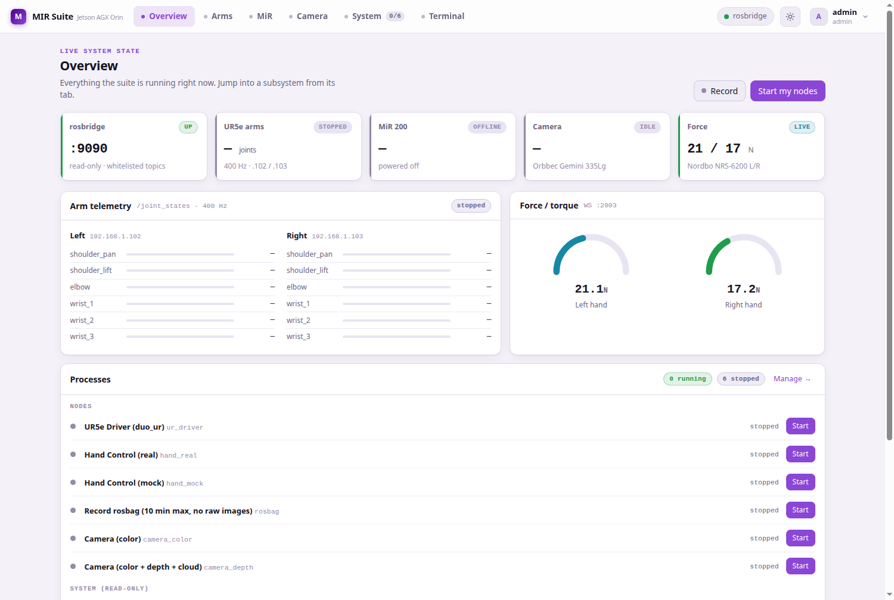
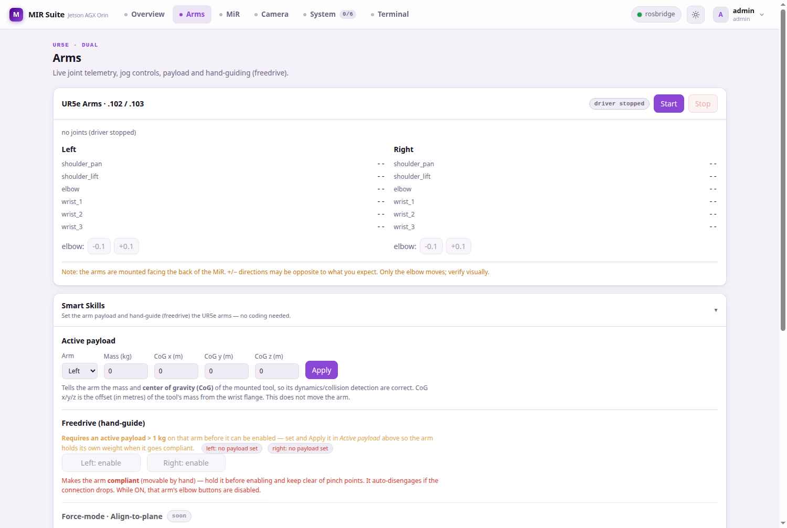
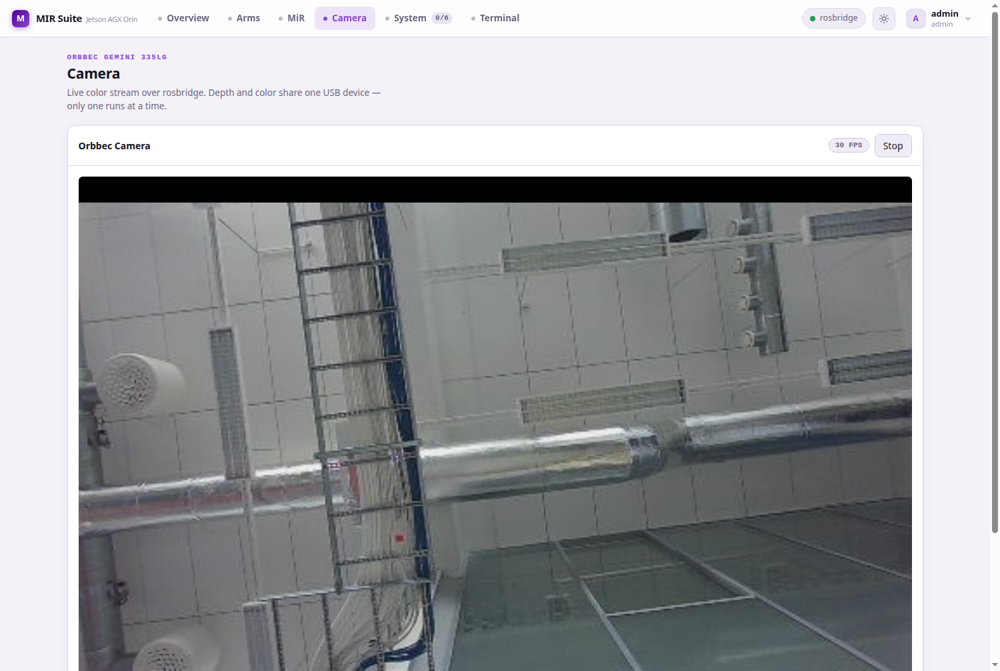
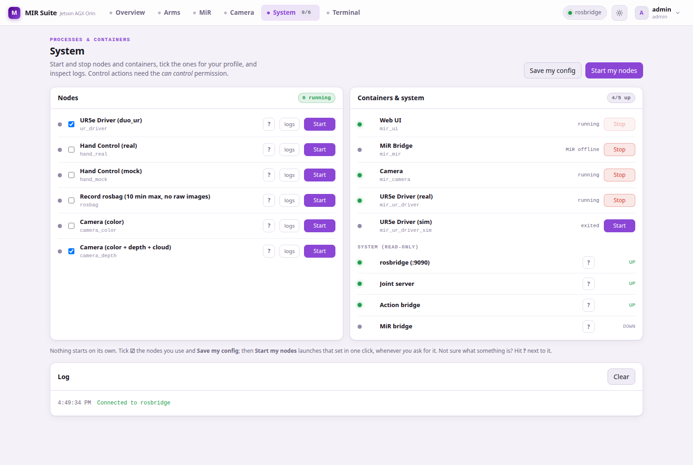
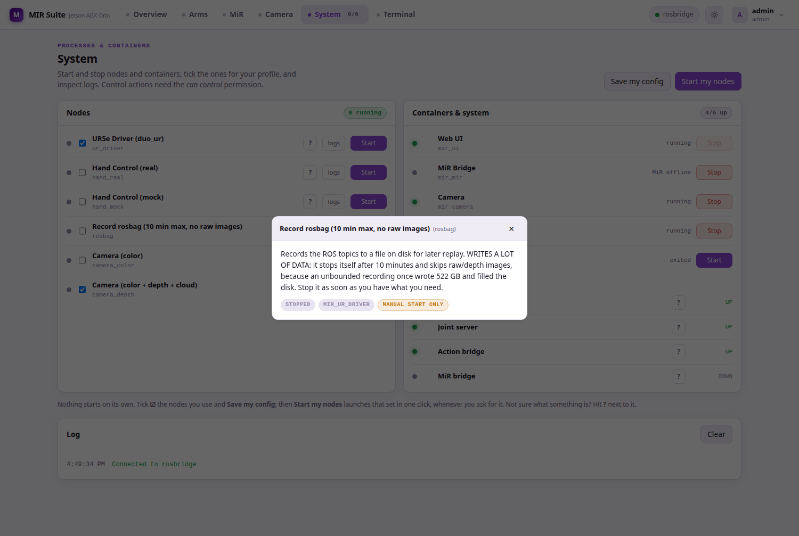
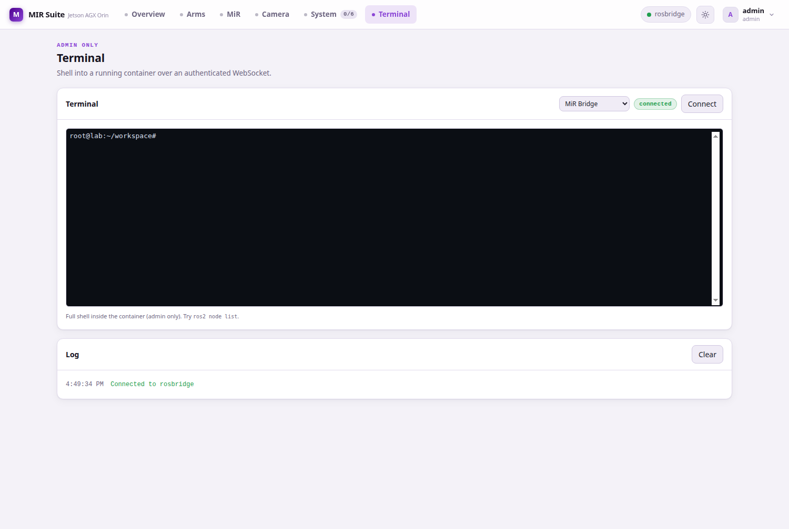
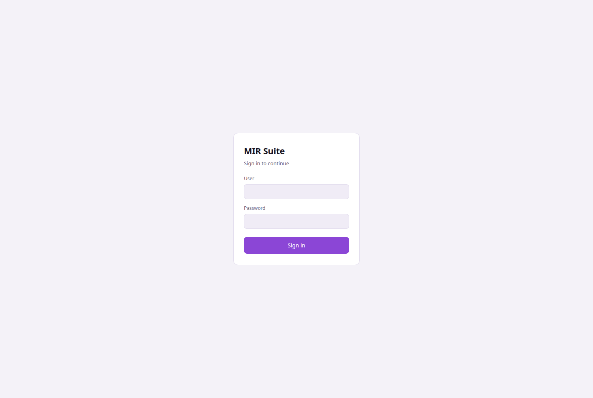

# MIR Suite — Technical Manual

**Mobile dual-arm manipulation platform · Tampere University (TUNI) / Fastlab**

| | |
|---|---|
| Document version | 1.0 — 13 July 2026 |
| Repository | `https://github.com/fjmp-dev/TUNI-PROJECT` (branch `refactor/by-component`) |
| Audience | Industrial/robotics engineers developing on the platform |
| Status of facts | Every version number, IP, port and command in this manual was read from the **running system** on 2026-07-13, not copied from older documents. |

> **[IMAGE HERE — cover photo]** Full-body photo of the robot: MiR200 base with both UR5e arms and the sensor head visible, taken from ~3 m at slight angle so both arms and the base are in frame. Caption: *"The platform: MiR200 mobile base carrying two UR5e arms, BrainCo hands, Orbbec camera and Nordbo F/T sensors, driven by an onboard Jetson AGX Orin."*

---

## 1. System overview and specifications

The MIR Suite is the software that turns a collection of robot hardware into one developable platform: a MiR200 mobile base, two Universal Robots UR5e arms, two BrainCo Revo1 dexterous hands, two Nordbo force/torque sensors and an Orbbec depth camera, all orchestrated by a single NVIDIA Jetson AGX Orin running Docker + ROS 2. Everything is operated from a web console served by the Jetson itself; no software needs to be installed on an operator's machine.

### 1.1 Hardware

| Component | Model | Interface | Address |
|---|---|---|---|
| Compute | NVIDIA Jetson AGX Orin (64 GB) | — | `192.168.1.75` (lan4) |
| Mobile base | MiR200 | WiFi → REST :80 + rosbridge :9090 | `192.168.1.14` (`MIR_IP`) |
| Left arm | Universal Robots UR5e | Ethernet, RTDE/primary | `192.168.1.102` |
| Right arm | Universal Robots UR5e | Ethernet, RTDE/primary | `192.168.1.103` |
| Hands | 2× BrainCo Revo1 (Stark) | USB-serial (FTDI) | `/dev/hand_L`, `/dev/hand_R` |
| Camera | Orbbec Gemini 335Lg (USB id `2bc5:080b`) | USB 3 | `/dev/bus/usb` |
| Force/torque | 2× Nordbo NRS-6200 | Ethernet, WebSocket :2003 | `.112` (left), `.113` (right) |
| Router | Teltonika RUTX50 (5G) | — | `192.168.1.1` |

Two physical facts every developer must know:

- **The arms are mounted facing the MiR's back.** This is intentional and must never be "corrected" in code, URDF or 3D views. A `+` jog can look inverted if you are standing at the MiR's front.
- The MiR's own safety PLC stays active underneath everything the suite does; its two SICK laser scanners enforce protective fields regardless of what we command.

> **[IMAGE HERE — arms orientation]** Photo from the MiR's side showing that the arms point toward the base's rear (the side with the back laser). Caption: *"The UR5e arms face the MiR's back; keep this in mind when interpreting jog directions."*

### 1.2 Software stack (verified on the live system)

| Layer | Component | Version |
|---|---|---|
| OS | Ubuntu 22.04.5 LTS, kernel `5.15.136-tegra` | L4T R36.3.0 (JetPack 6) |
| Containers | Docker / Docker Compose | 28.3.3 / v2.39.1 |
| ROS | ROS 2 Humble, `ROS_DOMAIN_ID=75`, FastDDS | — |
| UR driver | `Universal_Robots_ROS2_Driver` (vendored) + `ur-client-library` | 2.7.0 |
| Motion planning | MoveIt 2 | 2.5.9 |
| Web bridge | `rosbridge-server` | 2.0.5 |
| MiR client | `roslibpy` (inside the MiR bridge) | 2.0.0 |
| Backend | FastAPI / uvicorn / docker-py | 0.139.0 / 0.51.0 / 7.1.0 |
| Frontend | Svelte 5 (runes) + Vite | 5.55.x / 5.4.x |
| TLS proxy | Caddy | 2.x (image `caddy:2`) |

The ROS workspace (vendored external code: Eemil's `duo_ur` arm packages, the UR driver, MoveIt configs, the Orbbec driver) lives in `robot_workspace/ros_ws` and is **not** committed to this repository — see `documentation/EXTERNAL_PROJECTS.md`. Treat it as read-only: suite-side changes are made through overlays (section 4.1).

---

## 2. Architecture

### 2.1 The seven containers

Everything runs as Docker Compose services (`docker-compose.yml` at the repo root), all with `network_mode: host`:

| Service | Container | Profile | Role |
|---|---|---|---|
| `caddy` | `mir_caddy` | always on | TLS/plain reverse proxy; the **only** LAN-facing listener (:80, :443) |
| `mdns` | `mir_mdns` | always on | Publishes `mir-suite.local → 192.168.1.75` via the host's avahi |
| `mir_ui` | `mir_ui` | always on | FastAPI backend + the built web UI; talks to Docker via `/var/run/docker.sock` |
| `camera` | `mir_camera` | always on | Orbbec ROS 2 driver (started on demand as a *node*, see 5.3) |
| `mir` | `mir_mir` | always on | Selective MiR bridge + scanner merger + watchdog/liveness |
| `ur_driver` | `mir_ur_driver` | `arms`, `full` | UR driver, controllers, rosbridge, joint_server, action_bridge, hand node |
| `ur_driver_sim` | `mir_ur_driver_sim` | `sim` | Same image with mock hardware — test UI/flows without robots |

**None of the containers is `privileged`.** Access is granted per device class instead: the camera container gets `/dev/bus/usb` plus cgroup rule `c 189:* rmw` (libusb); the UR container gets `c 188:*` (USB-serial hands) and `SYS_NICE + IPC_LOCK` with rtprio/memlock ulimits for the driver's real-time loop.

### 2.2 One ROS graph, not seven

All ROS containers share `ROS_DOMAIN_ID=75` on the host network, so there is **a single ROS 2 graph**. `ros2 topic list` returns the same ~41 topics from any container — the container you stand in decides *where you look from*, not *what you see*. To see what actually runs inside one container use `ps aux | grep -E "python|ros"`; to see who publishes a topic use `ros2 topic info -v /scan`.

Two DDS facts cost us real debugging days; they are load-bearing:

1. **`/dev/shm` must be shared.** FastDDS uses shared memory between processes on the same host. Every ROS container therefore mounts the host `/dev/shm` (or `/dev`). Without it, discovery still works over UDP — topics *list* fine — but **no data flows** between containers. The symptom is "topic exists, zero messages".
2. **Stale SHM segments wedge the graph.** After hard kills (`docker rm -f`), leftover `fastrtps_*` files in `/dev/shm` can leave `ros2 topic list` empty or wedge the ros2_control service layer. Fix: stop the stack, then `docker run --rm --network none -v /dev/shm:/shm --entrypoint bash mir_ui:latest -c 'rm -f /shm/fastrtps_* /shm/sem.fastrtps_*'`, then start again.

### 2.3 Request path

```
Browser ── https/http ──> Caddy (:443/:80, host)
                            ├── /rosbridge  ──> rosbridge  (loopback :9090, read-only)
                            └── everything  ──> uvicorn    (loopback :8080)
                                                  │  FastAPI (main.py)
                                                  ├── docker exec ──> node scripts in containers
                                                  ├── http ──> joint_server (loopback :9091)
                                                  ├── http ──> MiR REST (192.168.1.14:80)
                                                  └── ws  ──> Nordbo sensors (:2003)
```

Live telemetry (camera frames, joint states) reaches the browser by **subscribing** through rosbridge. Commands never go through rosbridge — they go through the authenticated REST API, which executes inside the right container via `docker exec`. This split is what lets rosbridge be a read-only, whitelisted surface (section 8).

### 2.4 Build quirk (Jetson)

`docker compose build` fails on this Jetson because the kernel lacks the iptables `raw` table Docker's default bridge networking wants during builds. **Always build with host networking:**

```bash
docker build --network=host -f UI/ui_image/Dockerfile -t mir_ui:latest .
```

---

## 3. Network

### 3.1 Topology

The Teltonika RUTX50 is the lab router: its 5G SIM (Elisa) provides internet, its LAN (`192.168.1.0/24`) is the robot network, and it broadcasts the WiFi SSID **`Robot_suite`** (2.4 GHz only, channel 11 — fixed there because channel 1 is saturated by eduroam). The Jetson additionally has a university-network uplink on `lan1` (DHCP, currently `195.148.48.x`) used for internet access (git, apt).

| Device | IP | Notes |
|---|---|---|
| Teltonika RUTX50 | `192.168.1.1` | RutOS; admin UI on :80/:443 |
| Jetson AGX Orin | `192.168.1.75` | static, port `lan4`; also `mir-suite.local` via mDNS |
| MiR200 | `192.168.1.14` | via `Robot_suite` WiFi; set in `config/.env` → `MIR_IP` |
| UR5e left / right | `192.168.1.102` / `.103` | wired |
| Nordbo F/T left / right | `192.168.1.112` / `.113` | wired, WebSocket :2003 |

> **[IMAGE HERE — router]** Photo of the Teltonika RUTX50 with its WiFi/5G antennas as installed. Caption: *"Teltonika RUTX50: LAN 192.168.1.0/24, SSID Robot_suite (2.4 GHz ch 11), internet over the Elisa 5G SIM."*

The MiR's IP is assigned by the router's DHCP; if the MiR ever changes address, update `MIR_IP` in `config/.env` and `docker compose up -d mir mir_ui`. (A DHCP reservation on the router is the pending permanent fix.)

### 3.2 Ports on the Jetson

| Port | Bound to | What |
|---|---|---|
| 80, 443 | LAN (Caddy) | Web UI + API + `/rosbridge` + `/ca.crt` |
| 8080 | loopback only | uvicorn (behind Caddy) |
| 9090 | loopback only | rosbridge (behind Caddy at `/rosbridge`) |
| 9091 | loopback only | joint_server (arm telemetry for backend/mover) |
| 50001–50004 | LAN | UR reverse interface, **left** arm (script/trajectory ports) |
| 50011–50014 | LAN | UR reverse interface, **right** arm |

The arms' dashboard servers (:29999 on each robot) are **disabled** on both UR5e — recovery paths that would use them go through `resend_robot_program` instead.

---

## 4. Components

### 4.1 UR5e arms

**Code:** `UR/` (suite side) + vendored `robot_workspace/ros_ws/src/UR_arms/` (Eemil's `duo_ur`, the UR ROS 2 driver, MoveIt config — do not edit; overlay instead, e.g. `UR/duo_ur_launch_patch/` is bind-mounted read-only over the sim launch).

Both arms are driven by **one** `ur_ros2_control_node` in `mir_ur_driver`, launched by `UR/ur_start/ur_start.sh` (idempotent; killed by `UR/ur_stop/ur_stop.sh`). Key parameters, verified live: `headless_mode=True` (no pendant Play needed — the driver injects the External Control program over the primary interface), `reverse_ip=192.168.1.75`, per-arm reverse ports as in §3.2, `tf_prefix` `left_`/`right_`, joint states at **400 Hz**.

Supporting processes in the same container:

| Process | File | Role |
|---|---|---|
| `joint_server` | `UR/joint_server/joint_server.py` | Serves current joint positions on loopback :9091 |
| `joint_mover` | `UR/joint_mover/joint_mover.py` | One-shot CLI: sends a single `FollowJointTrajectory` goal, then verifies motion against :9091 |
| `action_bridge` | `UR/action_bridge/action_bridge.py` | Skills entry point (move_arm, open/close hand); clamps finger currents and velocities |
| `rosbridge` | patched launch in `UR/rosbridge_hardening/` | Read-only topic whitelist for the browser |

**The move chain** (what happens when you press a jog button in Arms):

```
UrPanel → POST /api/ur/move → backend _run_move (docker exec)
  → joint_mover.py → FollowJointTrajectory on /{arm}_joint_trajectory_controller
  → post-move check against joint_server :9091
```

If the arm did not actually move (the usual cause: the robot-side External Control program dropped its reverse-interface connection), the backend runs the recovery automatically: `resend_robot_program` → wait 3 s → re-activate the trajectory controller → retry. Per-request jog delta is capped by `UR_MAX_DELTA=0.5` rad.

**Logging caveat:** the UR client library registers its log handler once per process, so *all* URCL lines are tagged with the first arm's prefix (`right_`). "No `left_` lines" does **not** mean the left arm is disconnected — diagnose per-arm via hardware component states, never via log tags.

### 4.2 MiR200 base

**Code:** `MiR/`. Two independent access paths:

1. **REST API v2.0.0** (`http://192.168.1.14/api/v2.0.0/...`) — status, battery, mode. Used by the backend for the MiR tile/tab. Auth is HTTP Basic with `base64(user + ":" + sha256(password))`.
2. **Selective ROS bridge** (`MiR/bridge_mir/mir_bridge.py`, adopted from Wael's `fortis-uc1-tau` TK32) — connects to the MiR's own rosbridge (:9090 on the MiR) with roslibpy and republishes **only** the topics whitelisted in `MiR/bridge_mir/topic_config.yaml`:

| Direction | Topics |
|---|---|
| → MiR (publish) | `/cmd_vel` (direct base velocity; the MiR's safety PLC still gates it) |
| ← MiR (subscribe) | `/f_scan`, `/b_scan` (~13 Hz), `/odom` (**41 Hz**), `/tf`, `/tf_static`, `/MC/battery_percentage` |

The bridge deliberately filters out the MiR's `map→odom` TF so a future onboard SLAM can own localization. Its predecessor (`mir_raw.py`) republished *every* MiR topic and could saturate the shared DDS domain; if you find references to it in old documents, they are historical.

`MiR/bridge_mir/scanners_merger.py` fuses the two SICK scans into one 360° `/scan` (~12.5 Hz, frame `base_footprint`) — the input a future Nav2/SLAM stack expects.

**Self-healing:** the container entrypoint relaunches the bridge with backoff if the MiR is unreachable; `mir_watchdog.sh` kills a bridge that is "alive but mute" (no `/odom` for 25 s, with a 60 s startup grace) after probing whether the MiR side or our side is at fault; `mir_liveness.py` refreshes the heartbeat the watchdog reads. Do not hammer the MiR's rosbridge with rapid reconnects — that wedges the MiR side (it needs its own restart to recover).

> **[IMAGE HERE — MiR rear]** Photo of the MiR200 rear at ~1 m, crouching, showing the back laser scanner window and how the UR cables are routed above it. Caption: *"Back SICK scanner. Anything inside its protective field (including dangling cables) puts the MiR in emergency stop; keep the window clean and the cables tied."*

### 4.3 Camera (Orbbec Gemini 335Lg)

**Code:** `PERIPHERAL/camera_orbbec/`. The driver runs inside `mir_camera` and is started on demand from the UI as one of two mutually exclusive nodes (single USB device): **Camera (color)** — 480×270 @ 30 fps compressed color, what the Camera tab shows — or **Camera (color + depth + cloud)** for perception work. The browser receives `/camera/color/image_raw/compressed` via rosbridge; measured ~30 Hz end-to-end.

The container is de-privileged: `/dev/bus/usb` + cgroup `c 189:* rmw` survives replugs (device number changes, bus tree doesn't). If the camera hangs in a bad USB state, the node can reset it with the `USBDEVFS_RESET` ioctl — no extra capabilities needed. And it mounts `/dev/shm` explicitly; removing that mount reproduces the "topics visible, no frames" failure of §2.2.

### 4.4 Hands (BrainCo Revo1)

**Code:** `ENDEFFECTOR/hand_control_node/hand_control_node.py`, run inside the UR container (the hands' FTDI adapters enumerate there via `/dev/hand_L`, `/dev/hand_R` udev symlinks, stable across replugs). It uses the official **Python** `bc_stark_sdk` (aarch64) — the C++ SDK is x86-only and was a dead end. Finger positions are clamped to [0,1000] (thumb 500) and close currents to `[20,20,5,5,5,5]` per finger, in *both* command paths (hand node and action_bridge), so no UI or skill request can exceed them. A `--mock` variant exercises the full UI path with no hardware.

### 4.5 Force/torque (Nordbo NRS-6200)

No ROS node — the sensors speak their own WebSocket protocol on `:2003` (`{"cmd":"START_TRANSMISSION"}` starts the stream). The backend connects directly (`NORDBO_LEFT_IP`/`NORDBO_RIGHT_IP`, default `.112`/`.113`) and exposes `/api/force` plus per-side `tare`, `connect`, `disconnect`. The Arms tab shows live magnitudes.

---

## 5. Web UI

**Code:** `UI/web/` (Svelte 5 + Vite, built into the `mir_ui` image at build time — UI changes require an image rebuild; backend `main.py` is bind-mounted and only needs `docker restart mir_ui`).

### 5.1 Views and routing

The active tab lives in the URL hash — reload keeps your tab, browser back/forward navigates, links can be bookmarked:

| Route | View | Content |
|---|---|---|
| `#/overview` | Overview | Status tiles, live joint bars, force gauges, Record button, process list |
| `#/arms` | Arms | Joint telemetry + jog buttons, Skills, payload/freedrive, force panel |
| `#/mir` | MiR | Base status from the REST API (battery, state, position) |
| `#/camera` | Camera | Live color stream (30 fps) with node start/stop |
| `#/system` | System | Node launcher, containers, system processes, per-node logs |
| `#/terminal` | Terminal | Full bash inside a chosen container (admin only, ROS pre-sourced) |


*Overview: system state at a glance. The Record button starts/stops the bounded rosbag; the pulsing dot makes a running recording impossible to miss.*


*Arms: live joints at 400 Hz, jog controls, skills and force readings in one place.*


*Camera: the live Orbbec stream over rosbridge, with the FPS chip confirming the real rate.*

### 5.2 Users and permissions

Login is required for everything. Profiles are YAML files under `UI/backend/data/profiles/` (passwords stored as PBKDF2-SHA256; the directory is git-ignored). Two roles: `admin` (everything, incl. Terminal and user management) and `user`. A user additionally needs the **`can_control`** flag to start/stop anything or move the robot — without it the UI is read-only and the backend rejects control calls regardless of what the UI shows. Session tokens (`X-MIR-Token` header) expire after `TOKEN_TTL` (24 h default).

### 5.3 Node launcher — nothing starts by itself

The System tab manages *nodes* (processes inside containers) via a data-driven registry (`NODES` in `UI/backend/main.py`): the UR driver, real/mock hand control, the two camera variants, and the rosbag recorder. Design rules, learned the hard way:

- **Nothing auto-starts on login.** A profile's saved node list is a shortcut for the explicit *Start my nodes* button, not an autostart list. (Login used to auto-apply it; with `rosbag` saved in a profile, opening the web page silently started a recording that wrote 522 GB and filled the disk.)
- The **rosbag recorder is bounded**: hard 10-minute timeout, raw/depth image topics excluded, 2 GB file splits — ~600 MB per full run instead of unbounded gigabytes — and it is flagged `no_autostart`, so even a saved profile cannot launch it implicitly.
- Every node and system process has a **"?" popup** describing what it does, what hardware it needs, and what it costs, sourced from the same backend registry.


*System: nodes on the left, containers and read-only system processes on the right.*


*The "?" popup for the rosbag recorder — including why it is capped.*

### 5.4 In-browser terminal (admin)

A full bash inside `mir_ur_driver`, `mir_camera` or `mir_mir` (xterm.js over `/api/term`). The shell sources ROS automatically, so `ros2 ...` works immediately.


*Terminal: a real shell in the chosen container, ROS environment pre-loaded.*

---

## 6. Backend API reference

FastAPI app in `UI/backend/main.py`. All routes (except `/api/login` and `/health`) require the `X-MIR-Token` header; control routes additionally require `can_control`.

| Area | Route | Method | Purpose |
|---|---|---|---|
| Auth | `/api/login`, `/api/logout`, `/api/me` | POST/POST/GET | Session; `me` returns profile + config |
| Profile | `/api/me/config` | PUT | Save node list + settings |
| Profile | `/api/me/apply` | POST | Start saved nodes (skips `no_autostart` ones) |
| Users | `/api/users`, `/api/users/{u}` | GET/POST/PUT/DELETE | Admin user management |
| Containers | `/api/containers`, `/api/containers/{n}/start\|stop` | GET/POST | Compose service control |
| Nodes | `/api/nodes`, `/api/nodes/{id}/start\|stop\|logs` | GET/POST/GET | Node launcher + logs |
| System | `/api/system` | GET | Read-only infra process status |
| UR | `/api/ur/status\|start\|stop\|joints` | GET/POST | Driver lifecycle + telemetry |
| UR | `/api/ur/move`, `/api/ur/payload`, `/api/ur/freedrive` | POST | Jog (with auto-recovery), payload, hand-guiding |
| MiR | `/api/mir/status` | GET | REST-derived base status |
| Force | `/api/force`, `/api/force/{side}/tare\|connect\|disconnect` | GET/POST | Nordbo sensors |
| Terminal | `/api/term` | WebSocket | Admin shell (token via query param) |
| Health | `/health` | GET | Liveness |

Safety measures inside the backend worth knowing when extending it: `pkill` patterns are validated against a whitelist before execution (no shell injection through node definitions); per-node locks make start idempotent under double-clicks; the UR container identity comes from the `UR_CONTAINER` env var (no autodetection).

---

## 7. Operating guide

Every command below was executed on the real system while writing this manual.

### 7.1 Access

| URL | When |
|---|---|
| `http://192.168.1.75` | Works from any device on the lab network, no setup |
| `https://mir-suite.local` (or `https://192.168.1.75`) | Encrypted; requires installing the lab CA once per device |

To get the green padlock: browse to `http://192.168.1.75/ca.crt`, install the downloaded certificate as a **trusted authority** (Firefox: Settings → Certificates → Authorities → Import; Windows: "Trusted Root Certification Authorities"; Android/iOS: the OS offers to install it — iOS also needs Settings → General → About → Certificate Trust Settings). On any Linux machine, `config/tls/trust_ca.sh` does all stores at once — note that browsers on Linux ignore the system store, and **snap** browsers keep their own NSS database; the script handles both. Restart the browser fully afterwards.

> Plain HTTP is served **by decision**, so the team can always reach the UI: over :80 the login password and all robot commands travel unencrypted on the lab WiFi. Once the CA is installed on the machines that matter, re-enable the https redirect in `UI/caddy/Caddyfile`.


*Sign in — profiles are personal; ask an admin for an account with the permissions you need.*

### 7.2 Bring-up and shutdown

```bash
cd /home/lab/Desktop/MIR/mir_suite
docker compose up -d                          # caddy, mdns, mir_ui, camera, mir
docker compose --profile arms up -d           # + the UR driver container
docker compose --profile sim up -d            # (alternative) mock-hardware UR container
docker compose down                           # stop everything
```

Then in the UI: **System → Start** the nodes you need (UR driver, a camera variant), or set your profile once and use **Start my nodes**. Arms: power the robots on their pendants first; no Play needed — the suite runs them headless.

**Rule of the lab: test in the `sim` profile before touching real hardware.**

> **[IMAGE HERE — power & e-stop]** Photo of the MiR's blue power button and the red e-stop, labelled. Caption: *"Clean MiR shutdown = hold the blue button ~3 s and wait for full power-off. The red switch is the emergency cut, not the off button."*

### 7.3 Verifying data flows (web Terminal or `docker exec`)

The ROS graph is shared, so these work from **any** of the three shell containers:

```bash
ros2 topic list | wc -l         # ~41 topics; hundreds = something is flooding DDS
ros2 topic info -v /scan        # who publishes / who listens
ros2 topic hz /camera/color/image_raw/compressed   # ~30 Hz with a camera node running
ros2 topic hz /odom             # ~41 Hz with the MiR powered on
ros2 topic hz /joint_states     # ~400 Hz with the UR driver running
ros2 control list_controllers   # only answers while the UR driver is up
```

A topic that *lists* but gives no `hz` output means the publisher is down (MiR off, camera stopped) — or, if the publisher is provably up in another container, the `/dev/shm` problem of §2.2.

### 7.4 Recording data

Overview → **Record** (or System → rosbag → Start). It stops itself after 10 minutes, skips raw image topics and splits files at 2 GB; bags land in `logs/bag_<timestamp>/` (owned by root — delete via `docker exec mir_camera rm -rf /var/log/mir/bag_<ts>`). Stop it as soon as you have what you need; check disk headroom with `df -h /` before long recordings.

### 7.5 Updating the software

```bash
git pull
# backend only (main.py is bind-mounted):
docker restart mir_ui
# UI/frontend or Dockerfile changes (host networking is mandatory on this Jetson):
docker build --network=host -f UI/ui_image/Dockerfile -t mir_ui:latest .
docker compose up -d --force-recreate mir_ui
```

---

## 8. Security

The suite runs on a lab LAN, but "someone on the same WiFi" is exactly the attacker model that matters for a robot. What is in place, and what is consciously accepted:

| Measure | Detail |
|---|---|
| No `privileged` containers | Device access via cgroup rules (`c 188`/`c 189`) + `SYS_NICE`/`IPC_LOCK` only where the RT loop needs it |
| LAN surface = Caddy only | uvicorn :8080, rosbridge :9090 and joint_server :9091 all bind loopback |
| rosbridge is read-only | Whitelist: the camera topic; services/actions deny-all. Commands must go through the authenticated REST API — there is no path to `FollowJointTrajectory` or `/cmd_vel` from the browser socket |
| Auth + `can_control` | Every actuation endpoint checks the per-user flag server-side; tokens expire (24 h) |
| Command hardening | `pkill` pattern whitelist, per-node start locks, hand current/position clamps, `UR_MAX_DELTA` |
| TLS with a private CA | Two-tier PKI (`config/tls/gen_cert.sh`): a 10-year lab root signs the 825-day server cert; reissuing the server cert never touches client trust stores. Root served at `/ca.crt`; `ca.key` never leaves the Jetson (mode 600, git-ignored) |
| Secrets out of git | `.env`, `*.key`, `*.pem`, `UI/backend/data/` (password hashes) are git-ignored |

**Accepted risks, stated plainly:** (1) plain HTTP on :80 exposes credentials and commands to the local network — a deliberate usability trade-off until the CA is deployed everywhere (§7.1); (2) factory/default passwords on lab equipment remain by the user's decision; the backend logs a warning at boot while seed passwords are unchanged; (3) whoever holds `ca.key` can mint certificates any CA-trusting device would accept — install the lab CA only on machines that operate the robot.

`SECURITY.md` in the repo root is the living hardening log with the full history and verification steps of each measure.

---

## 9. Appendix

### 9.1 Repository layout

```
mir_suite/
├── docker-compose.yml       # the 7 services
├── config/                  # .env (MIR_IP, arm IPs, ports, TTLs), tls/ (CA + certs + scripts)
├── UI/                      # caddy/, mdns/, backend/ (FastAPI), web/ (Svelte), ui_image/
├── UR/                      # entrypoints, start/stop, joint_server/mover, action_bridge,
│                            #   rosbridge_hardening/, duo_ur_launch_patch/ (overlays)
├── MiR/                     # bridge_mir/ (bridge + merger + topic_config.yaml),
│                            #   mir_entrypoint/, mir_watchdog/, mir_liveness/, mir_image/
├── PERIPHERAL/              # camera_orbbec/ (+ mics/speakers placeholders)
├── ENDEFFECTOR/             # hand_control_node/ (BrainCo Revo1)
├── BATTERY_MS/ HEAD_NECK/ ROUTER_MODEM/   # findings/docs per subsystem
├── documentation/           # THIS MANUAL (+ build_manual.sh, manual_images/)
├── logs/                    # runtime logs + rosbags (git-ignored)
└── robot_workspace/         # vendored ROS workspace (git-ignored, read-only)
```

### 9.2 Environment variables (`config/.env`)

`ROS_DOMAIN_ID=75`, `UI_PORT=8080`, `UI_BIND_HOST=127.0.0.1`, `MIR_IP=192.168.1.14`, `LEFT_ARM_IP=192.168.1.102`, `RIGHT_ARM_IP=192.168.1.103`, `TOKEN_TTL=86400`, `NORDBO_LEFT_IP`/`NORDBO_RIGHT_IP`/`NORDBO_PORT`, seed-user passwords (change before production; the backend warns at boot while defaults are in use). Credential *values* live only in `config/.env` and are never committed.

### 9.3 Photo checklist (to complete this manual)

Shoot these in one pass and drop each into its `[IMAGE HERE]` box:

1. **Cover** — full robot, ~3 m, slight angle (§ top).
2. **Arms orientation** — side view showing arms facing the MiR's rear (§1.1).
3. **Teltonika router** with antennas (§3.1).
4. **MiR rear laser** — crouched, ~1 m, scanner window + cable routing visible (§4.2).
5. **Power/e-stop buttons** — blue power and red e-stop, close-up (§7.2).
6. Optional: the Jetson mounted on the platform; a UR5e pendant showing Remote Control.

### 9.4 Related documents

- `SECURITY.md` — hardening log (current).
- `documentation/PLAN_REFACTORIZACION.md` — refactor status and phase-2 investigation notes.
- `documentation/EXTERNAL_PROJECTS.md` — the vendored external repos and how `robot_workspace/` replaces them.
- Per-component docs: `MiR/documentation/`, `UR/documentation/`, `ENDEFFECTOR/documentation/`, `BATTERY_MS/`, `HEAD_NECK/`, `ROUTER_MODEM/documentation/hallazgos.md`.
- Every script folder has a README describing that script.

*Build the Word version with `documentation/build_manual.sh` (regenerates `MIR_SUITE_MANUAL.docx` from this file).*
