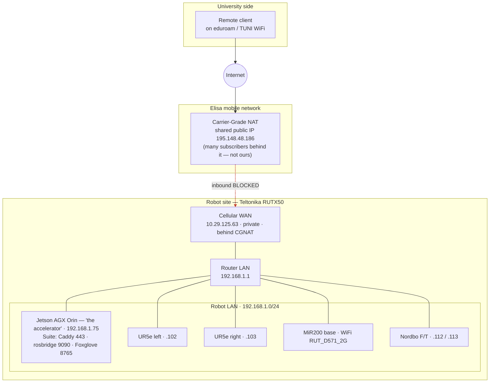

# Network & remote access — Elisa CGNAT

**Key finding (verified live 2026-07-16):** the Elisa SIM sits behind **Carrier-Grade NAT**.
The router's cellular address is a *private* `10.29.125.63`, while the internet sees a *shared*
`195.148.48.186` that belongs to Elisa, not to us. Because those two do not match, **no inbound
connection from the internet can reach the router** — a plain port-forward cannot work until the
SIM's addressing changes.

Outbound works (that is how the robot has internet). It is the *inbound* path — remote client →
internet → into the robot — that CGNAT breaks.

## Three ways to reach the robot from anywhere

| Option | Works through CGNAT today? | Notes |
|---|---|---|
| **1. Public IP from Elisa** | No — needs the paid add-on | Order a public/static IP for the SIM; then port-forward 443 or run WireGuard on the router. Wael's original plan; needs the SIM feature first. |
| **2. Teltonika RMS** | **Yes** | Router dials out to Teltonika's cloud, which relays the client in. No public IP. Per-device subscription. |
| **3. Reverse WireGuard** | **Yes** | Robot dials out to a cheap VPS with a public IP; client connects to the VPS. Cost = the small VPS. |

Options 2 and 3 work because the robot opens the tunnel **outward** — CGNAT only blocks connections
coming in.

## Non-negotiable hardening before ANY exposure

The Suite still ships with factory passwords, plain HTTP on port 80, and an admin terminal that opens
a root shell. Safe on a closed lab network; unacceptable facing the internet. Before opening any path:
change every default password, serve **HTTPS only**, and keep the terminal off the public side
(ideally the whole Suite behind the VPN). See [[audit-fixes-2026-07-16]], `SECURITY.md`.

## LAN addresses

| Device | Address | Role |
|---|---|---|
| Teltonika RUTX50 | `192.168.1.1` | Router / gateway, SIM uplink |
| Jetson AGX Orin | `192.168.1.75` | Runs the Suite (Caddy 443 · rosbridge 9090 · Foxglove 8765) |
| UR5e left / right | `192.168.1.102` / `.103` | Arm drivers (RTDE) |
| Nordbo F/T | `192.168.1.112` / `.113` | Wrist force/torque sensors |
| MiR200 base | WiFi `RUT_D571_2G` | Mobile base (own SSID, 2.4 GHz) |
| Cellular WAN | `10.29.125.63` | Private — behind Elisa CGNAT |

> A stable cellular link is only as reliable as coverage: in a basement or lift with no signal, comms
> drop regardless of configuration — a physical limit, not a software one.
